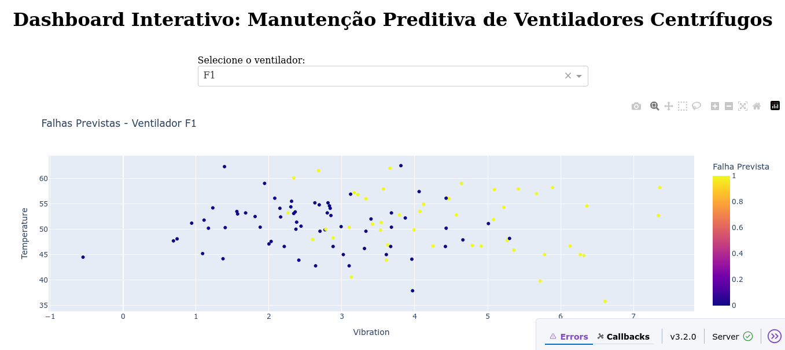

# 🧠 Previsão de Falhas em Ventiladores Centrífugos – Dashboard Interativo

## 📘 Descrição do Projeto

Este projeto demonstra a aplicação prática de **Ciência de Dados na manutenção industrial**, com foco em **manutenção preditiva de ventiladores centrífugos**.  

Ele integra **análise de dados, modelagem preditiva e visualização interativa**, simulando um sistema de monitoramento inteligente de equipamentos industriais.

O projeto inclui:
- 🔍 **Análise exploratória de dados** (vibração, temperatura, pressão)
- ⚙️ **Modelo preditivo de falhas** com *Random Forest*
- 📊 **Dashboard interativo** construído com *Dash* e *Plotly*
- 📈 **Visualizações dinâmicas** de variáveis operacionais e alertas de falha
- 🧩 **Simulação completa** de dados de sensores industriais

> 💡 **Nota:** Todos os dados utilizados são **simulados** apenas para fins de portfólio e teste do modelo.  
> Nenhuma informação real foi coletada em campo.

---

## 🖼️ Preview do Dashboard



---

## 🗂️ Estrutura do Repositório

```text
ventiladores-dashboard/
│
├── data/
│   └── ventiladores_simulados.csv      # Base de dados simulada
│
├── app.py                              # Código principal do dashboard (Dash + Plotly)
├── requirements.txt                    # Dependências do projeto
├── screenshot.png                      # Imagem de preview do dashboard
└── README.md                           # Documentação e instruções


